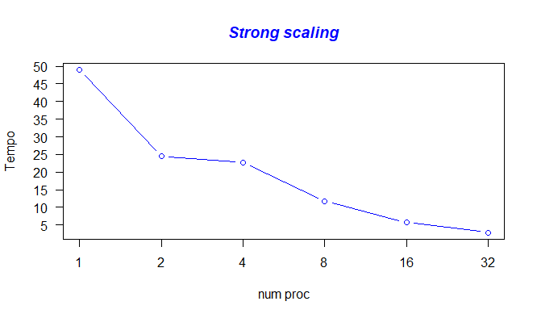
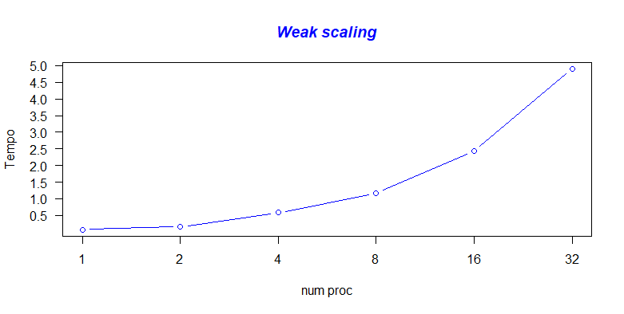
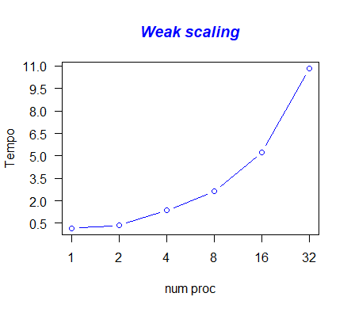

# PCPC- Nbody
#  Oliva Laura 0522500817 

 **Soluzione proposta**

#####  La soluzione proposta segue lo schema definito nell'algoritmo sequenziale di [Nbody](https://github.com/harrism/mini-nbody/blob/master/nbody.c/ "Nbody"). 

##### Inizialmente con un algoritmo viene effettuato il calcolo per suddividere il lavoro in maniera equa tra tutti i processi,incluso il master.
Una volta completata la suddivisione si esegue la funzione bodyforce e successivamente ogni processo deve inviare la propria porzione a tutti
gli altri processi, in modo che siano in grado di effettuare il prossimo step della simulazione.
Viene quindi stampato il tempo di esecuzione totale e la media del tempo tra le varie iterazioni.
Infine le risorse utilizzate vengono liberate.

Per eseguire il file si utilizzano i seguenti comandi con l'opzione -lm per linkare la libreria math.h:
	mpicc <nomefile.c> -o <nomeeseguibile> -lm |
	mpirun -np <num processi> <nomeeseguibile> < num particelle> <num iterazioni> <nome file> |


 **Struttura del progetto**

##### Dopo l'inzializzazione delle variabile viene creata la struttura di tipo MPI per facilitare lo scambio di messaggi tra i processi 
``` c
	count = 6;
  	int array_of_blocklengths[6] = {1, 1, 1, 1, 1, 1};

	// dichiarazione dei tipi dei datatype 

  	MPI_Datatype array_of_types[6] = {MPI_FLOAT, MPI_FLOAT, MPI_FLOAT, MPI_FLOAT, MPI_FLOAT, MPI_FLOAT};
	
	// inizializzazione dell'array che contiene lo spostamento per ogni blocco espresso in byte  
	MPI_Aint array_of_displacements[6];
  	array_of_displacements[0] = sizeof(float) * 0;
  	array_of_displacements[1] = sizeof(float) * 1;
  	array_of_displacements[2] = sizeof(float) * 2;
  	array_of_displacements[3] = sizeof(float) * 3;
  	array_of_displacements[4] = sizeof(float) * 4;
  	array_of_displacements[5] = sizeof(float) * 5;
	
	//creazione del datatype 
	MPI_Type_create_struct(count, array_of_blocklengths, array_of_displacements, array_of_types, &body_type);
  
	MPI_Type_commit(&body_type);
```
##### Poi vengono controllati i parametri di input; l'utente può scegliere il numero di particelle e il numero di iterazioni, e settare un flag,
passare anche il nome di un file da linea di comando, da cui estrarre le particelle. Se non viene passato nessun parametro da linea di comando, il
numero di particelle è fissato a 10000 e il numero di iterazioni a 5.
Vengono utilizzati i seguenti array per la divisione delle particelle in modo equo:

``` c
	sendcnts = (int*)malloc(sizeof(int)*world_size);
	displs = (int*)malloc(sizeof(int)*world_size);
```
##### Il primo rappresenta il numero di elementi per processo il secondo è il puntatore alla posizione iniziale della partizione.
Successivamente vengono passati alla seguente funzione 

``` c
	void create_sendcnts_displs(int *sendcnts,int *displs,int n_bodies,int world_size){
  		int resto = n_bodies % world_size;
 		int last = 0;

  		for(int i=0; i<world_size; i++){
   		 sendcnts[i] = n_bodies / world_size;
   		 if(resto > 0){
     			 resto--;
     			 sendcnts[i] = sendcnts[i] + 1;
    		}
    		displs[i] = last;
    		last = last + sendcnts[i];
 		}
	}
```
##### Viene quindi effettuata la computazione parallela, in cui vengono passati alla funzione i valori di inizio e fine della propria sezione. 
	
``` c
	void body_force(Body *body, float dt, int n_bodies, int start, int end){
    		for(int i = start; i < end; i++){
      			float Fx = 0.0f; float Fy = 0.0f; float Fz = 0.0f;

		for(int j = 0; j < n_bodies; j++){
        		float dx = body[j].x - body[i].x;
        		float dy = body[j].y - body[i].y;
        		float dz = body[j].z - body[i].z;
        		float distSqr = dx*dx + dy*dy + dz*dz + SOFTENING;
        		float invDist = 1.0f / sqrtf(distSqr);
        		float invDist3 = invDist * invDist * invDist;

		        Fx += dx * invDist3; Fy += dy * invDist3; Fz += dz * invDist3;
      		}
      		body[i].vx += dt*Fx;
      		body[i].vy += dt*Fy;
      		body[i].vz += dt*Fz;
    		}

	}

```

**Analisi delle perfomance**

##### Per il mio progetto, avevo a disposizione le macchine di AWS m4.xlarge; ognuna di queste macchine ha 4 vCPU e 16 GB di RAM.
è stato creato un cluster con 8 istanze di queste macchine.
Tutti i test sono stati quindi effettuati utilizzando il seguente comando

 ``` c mpirun -hostfile hostfile  -np X  progetto Y ```

##### Dove X indica il numero di processori (1,2, 4, 8, 16, 32) e Y indica il numerdo di corpi su cui effettuare la simulazione (50000, 2000X, 3000X).


*Strong scaling*

##### La scalabilità forte è il tempo impiegato per risolvere un problema di grandezza fissata dato un numero variabile di processi.
In questo testing sono state utilizzate 50.000 particelle.
Di seguito vengono riportati sotto forma tabellare e successivamente grafica i tempi di esecuzione dei test:

Numero proc| tempo
:---------:|:-----:
1|48.9335
2|24.5292
4|22.6842
8|11.7401
16|5.6917
32|2.8991

##### Grafico con 50000 particelle   


 *Weak scaling* 

##### La scalabilità debole è  l' aumentare la grandezza del problema in modo proporzionale al numero di processi.
Sono state effettuati due testing nel primo sono state utilizzate 2000 particelle per processo mentre nel secondo 3000 per processo.
Di seguito vengono riportati sotto forma tabellare e successivamente grafica i tempi di esecuzione dei test:

N Part| Numero proc| tempo
:-----:|:---------:|:-----:
2000|1|0.0758
4000|2|0.1570
8000|4| 0.5810 
16000|8|1.1681
32000|16|2.4403
64000|32|4.8944


##### grafico con 2000 particelle per proc 


N Part| Numero proc| tempo
:-----:|:---------:|:-----:
3000|1|0.1761
6000|2|0.3532
12000|4|1.3654  
24000|8|2.6231
48000|16|5.2452
96000|32|10.8252

##### grafico con 3000 particelle per proc



